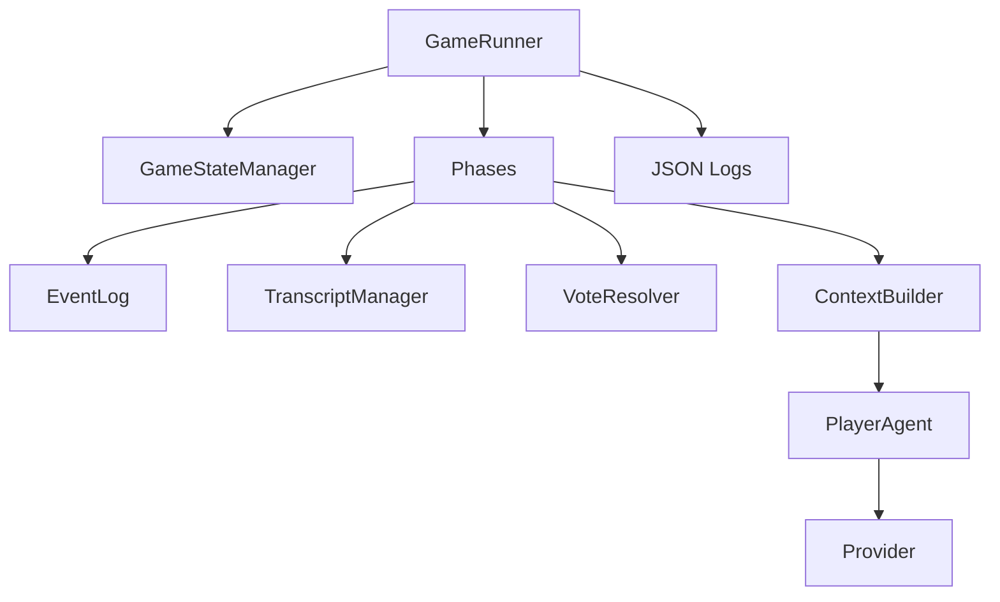
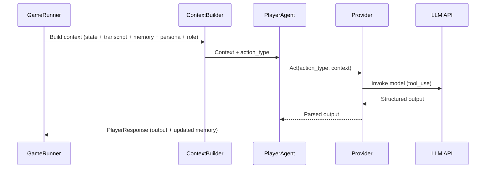
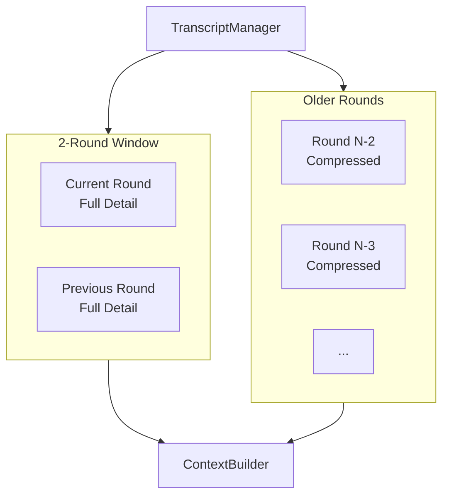

# System Design

How the game system works at a high level.

## Components

**Game Engine** is the orchestration logic. It manages game state, enforces rules, controls turn order, and runs the game loop. It is deterministic code, not an LLM.

**Narrator** is an LLM that produces flavor content. It announces deaths, comments on dramatic moments, and creates the storytelling layer for viewers. It does not make game decisions or manage players.

**Players** are LLM agents that play the game. Each player has their own identity, memory, beliefs, and reasoning process. They receive game state, process it, and produce actions.

## Architecture Diagrams

## Game Engine Responsibilities

- Initialize game and assign roles randomly
- Run the game loop in correct phase order
- Call players when it's their turn
- Collect and validate player outputs
- Update game state after each action
- Track nominations and votes
- Detect win conditions
- Produce structured game log

## Narrator Responsibilities

- Generate opening game introduction
- Announce night kills with flavor
- Announce vote results
- Provide dramatic commentary on key moments
- Generate game end summary

**Critical constraint:** The narrator NEVER summarizes, reframes, or paraphrases player speeches. Players receive exact transcripts from the engine. Context compression (for older rounds) is performed by the engine using fixed rules, not by the narrator. This prevents any hidden advantage from narrator interpretation.

The narrator is optional for MVP. Game can run without it. Narrator adds entertainment value but doesn't affect game logic.

## Player Responsibilities

- Receive game state and recent transcript
- Maintain private memory and beliefs
- Reason about the situation
- Produce speech and nomination when speaking
- Produce vote when voting
- Produce night action when applicable
- Maintain persona consistency

## Game Loop

The game engine runs this loop:

**Initialization:**
1. Assign roles randomly
2. Inform each player of their role
3. Inform Mafia players of all partners

**Night Zero:**
1. Call each Mafia player for coordination (single round, no back-and-forth):
   - Each receives: role, partner identities, prompt for strategy discussion
   - Each returns: strategy notes (signals to use, cover stories, initial suspicion targets)
   - Engine shares all strategies with all Mafia (they see each other's plans)
2. No kill occurs, no Detective or Doctor action

**Day One:**
1. Narrator announces day begins (no death)
2. For each player in speaking order (starts at seat 0):
   - Call player with current game state and transcript so far
   - Player returns speech and nomination
   - Append speech to transcript
3. Collect votes from all living players
4. Resolve votes (likely skip on day one)

**Subsequent Nights:**
1. Call Mafia for kill target (may skip). Round 1: each proposes. If 2/3+ agree, execute (skip counts as a target). If split, run Round 2. If still split after Round 2, lowest-seat Mafia decides.
2. Call Doctor for protection target
3. Call Detective for investigation target
4. Return investigation result to Detective
5. Resolve night outcome (apply kill if not protected)

**Subsequent Days:**
1. Narrator announces night kill (no last words - night kills are silent)
2. For each living player in speaking order (first speaker advances by one seat each day; if that seat is dead, skip to next living):
   - Call player with game state and transcript
   - Player returns speech and nomination
   - Append to transcript
3. Collect votes from all living players
4. Resolve vote:
   - If plurality: eliminate player, collect last words
   - If tie for most (players only) or skip ties with one player: run revote micro-phase
   - If "skip" wins plurality or ties with 2+ players: no elimination
5. Check win condition

**Revote micro-phase** (only if tie):
1. Call each tied player for defense speech (shorter than regular speech)
2. Collect revote from all living players (options: tied players + skip)
3. If plurality: eliminate. If still tied or "skip" wins: no elimination.

**Game End:**
1. Narrator announces winner
2. Reveal all roles
3. Output complete game log

## Player Turn Flow

Players are called **sequentially**, not in parallel. Each player must hear all previous speeches before their turn. This ensures:
- Players can react to what others said
- Contradictions and accusations can be tracked
- Speaking order matters strategically

When a player is called to speak:

**Input they receive:**
- Their role and private knowledge
- Current game state (alive players, dead players, current phase, round number)
- Full transcript of current round so far
- Summarized history of previous rounds
- Their own memory/belief state from previous turns

The engine packages these into a prompt via the ContextBuilder. The PlayerAgent passes that prompt to the provider, which returns a raw action output dict. The PlayerAgent validates it and wraps it into `PlayerResponse` with updated memory.

**Processing they do:**
- Update beliefs based on new information
- Reason about suspicions, alliances, threats
- Decide strategy for this speech
- Generate public speech (may differ from private reasoning)
- Choose nomination

**Output they return:**
- Speech text
- Nominated player
- Updated memory/belief state (stored for next turn)

When a player is called to vote:

**Input:** Same as above, plus complete transcript of discussion and list of nominated players

**Output:** Vote choice (nominated player or skip), updated memory/belief state

## Information Visibility

See [05_context_management.md](05_context_management.md) for detailed format specifications.

**What players see:**
- Their own role and private knowledge
- Mafia partner identities (Mafia only)
- Public game state (who's alive, who's dead)
- All speeches from current and past rounds
- All nominations and votes
- Night kill announcements (not who killed)

**What players don't see:**
- Other players' roles
- Other players' private reasoning
- Other players' memory/belief states
- Mafia night discussion (unless they're Mafia)
- Detective results (unless they're Detective)
- Doctor protection outcomes (unless they're Doctor, and they do not get a success flag)

**Context visibility:** Players only receive public information. Private fields are stored in
event logs for replay but are filtered out of player prompts.

## State Management

**Game State (managed by engine):**
- Phase (night zero, day one, night one, etc.)
- Living players list
- Dead players list
- Current speaking order
- Nominations this round
- Votes this round
- Win condition status

**Player State (defined by player, stored by engine):**
- Role and private knowledge
- Memory of observed events
- Beliefs and suspicions
- Relationship tracking
- Strategy notes

Players define and update their state each turn. Engine persists it between calls and passes it back on next call. Players don't persist their own state (LLMs are stateless).

## Event Log

The engine maintains a single event stream throughout the game for replay and
persistence. It is not used to build player prompts during runtime.

**During game (runtime):**
- Events appended as they occur (speeches, votes, deaths, night actions)
- ContextBuilder uses transcript + memory; EventLog is not read for prompts
- Private fields are kept for replay but are not sent to other players
- Recent rounds provided verbatim, older rounds compressed (see [05_context_management.md](05_context_management.md))

**After game (persistence):**
- Full log saved to JSON file in `logs/`
- Viewer view includes private reasoning (creates dramatic irony)
- Analysis view adds timestamps for debugging and metrics

Event types include (non-exhaustive): `speech`, `vote_round`, `elimination`,
`mafia_discussion`, `mafia_vote`, `doctor_protection`, `investigation`, `night_resolution`.

See `src/schemas/core.py` for `Event` and `src/schemas/transcript.py` for
`DayRoundTranscript` and `CompressedRoundSummary` definitions.

## What Is Fixed vs Customizable

**Fixed (shared by all players):**
- Game rules
- Game loop logic
- Turn structure
- Validation rules
- Input/output interface
- SGR reasoning schema
- Memory/belief storage format

**Customizable per player:**
- Persona (see [04_player_agent.md](04_player_agent.md) for full spec):
  - Identity (name, background, core traits)
  - Voice and behavior (speech style, reasoning style, accusation/defense style, trust disposition, risk tolerance, signature phrases, quirks)
  - Role guidance (optional, brief - contextualizes traits per role)
  - Relationships (optional, fixed lore with other personas)

There are no separate "memory strategy" or "reasoning structure" modules. The persona IS the strategy - it instructs the LLM how to interpret events, what to prioritize, and how to behave.

**Customizable per game:**
- Which personas participate
- Which model powers the players
- Random seed

## Error Handling

### Invalid Player Output

If a player returns invalid output (malformed response, invalid target, etc.):
1. Retry the LLM call up to 3 times with error feedback
2. If still invalid after 3 retries, apply default action:
   - **Speaking:** Random valid nomination, generic speech ("I need more time to think")
   - **Voting:** Skip
   - **Night kill:** Random valid target (or first Mafia decides if coordination fails)
   - **Investigation:** Random living non-self player
   - **Doctor protect:** Random living player (allow self)

Invalid outputs are logged for debugging but don't halt the game.
