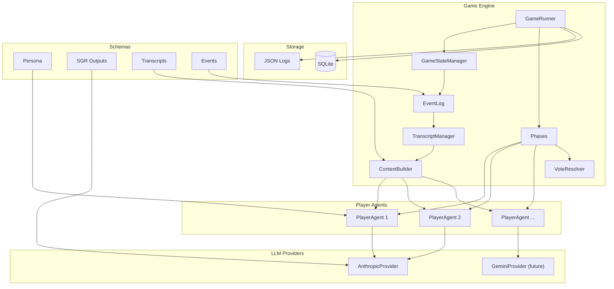
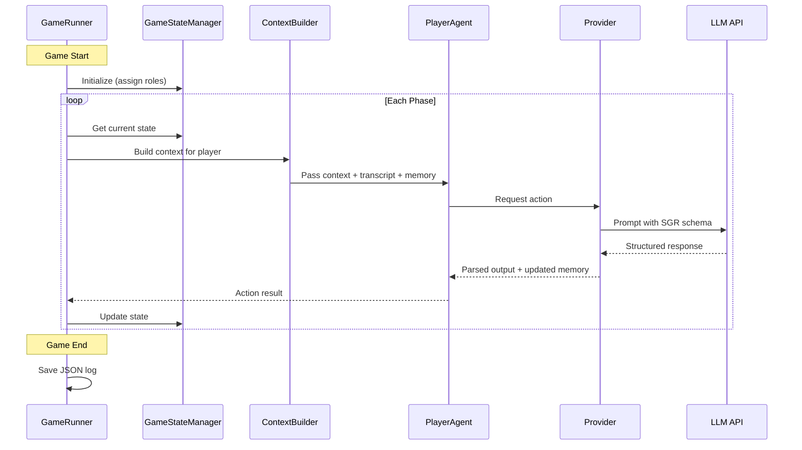
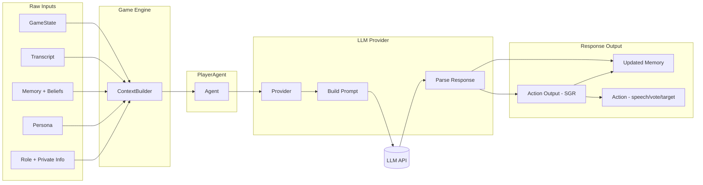
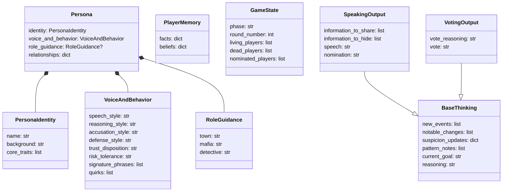
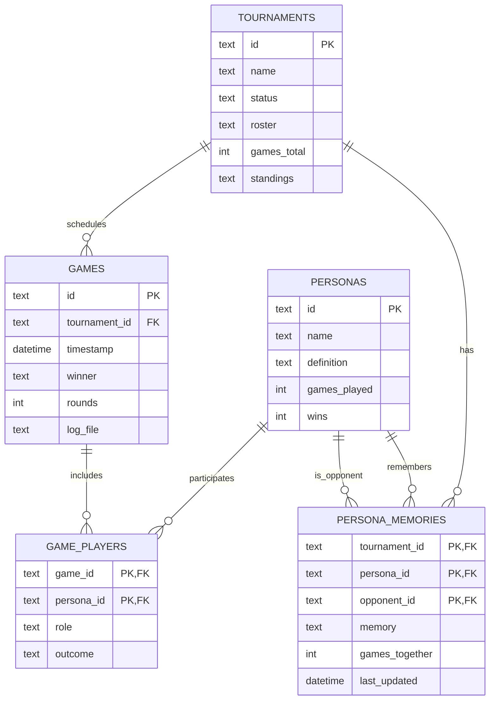
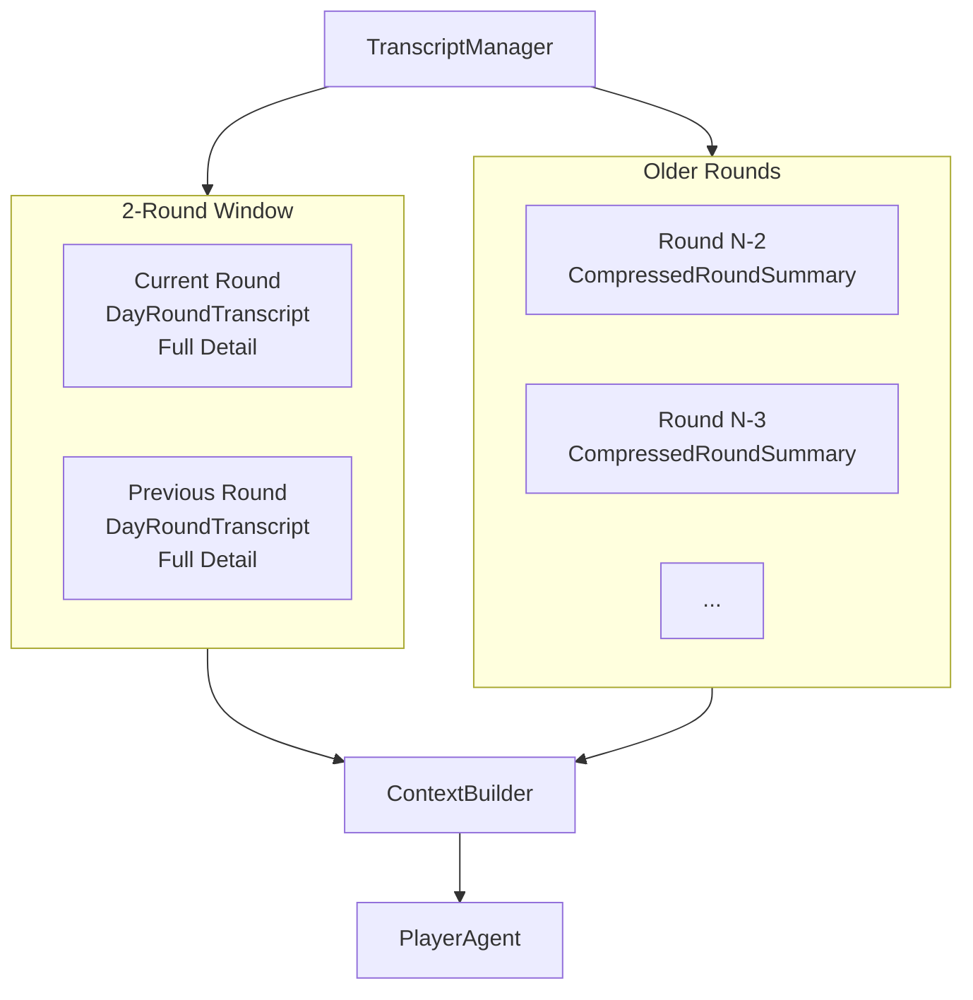
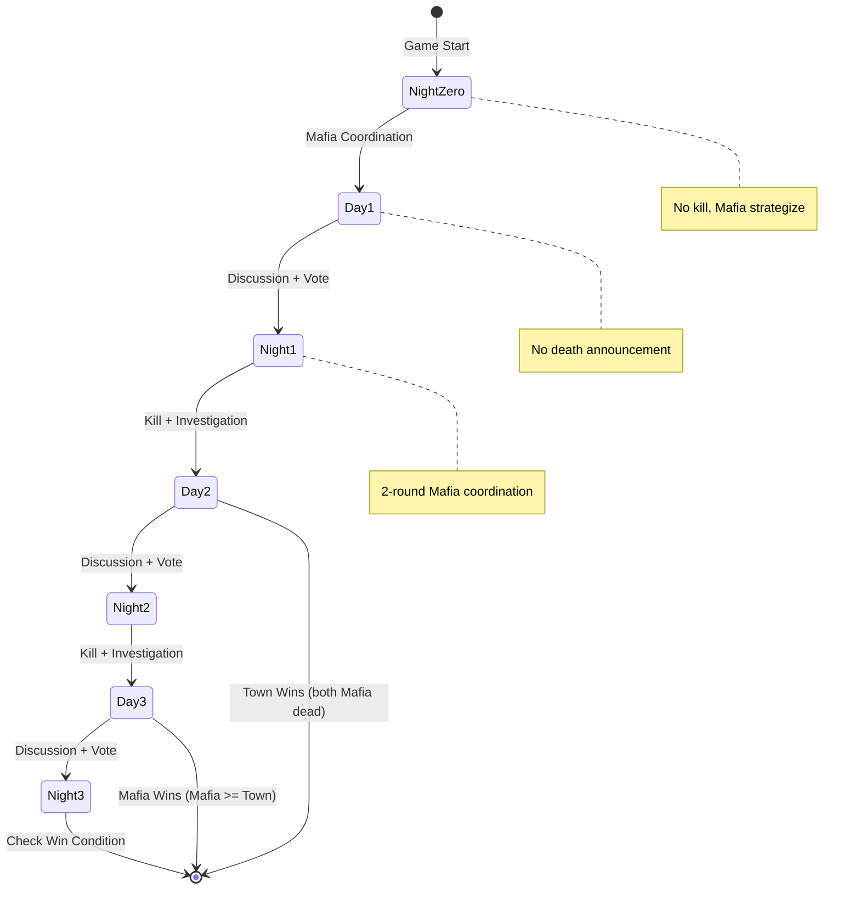
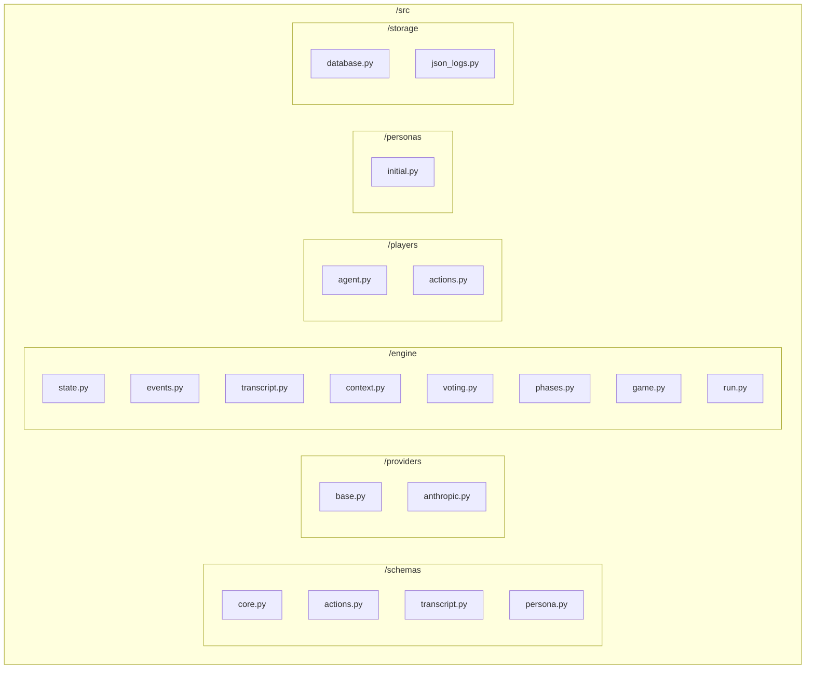

# Architecture

Visual overview of system components and their interactions.

## High-Level Components

## Game Flow Sequence

## Data Flow: Player Turn

## Schema Relationships

## Database ERD (SQLite)

## Transcript Window

## Engine Phases

## File Structure

