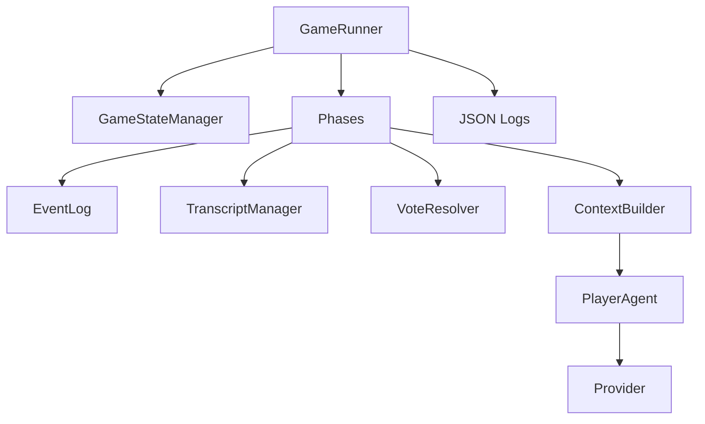
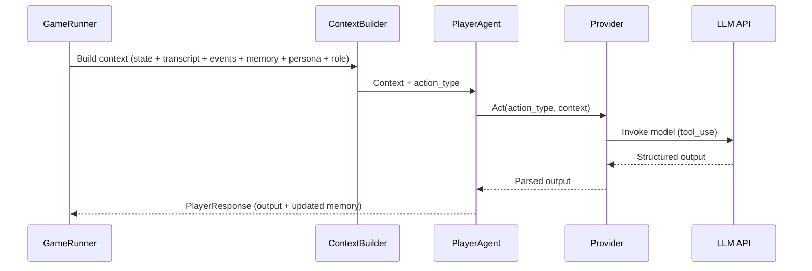
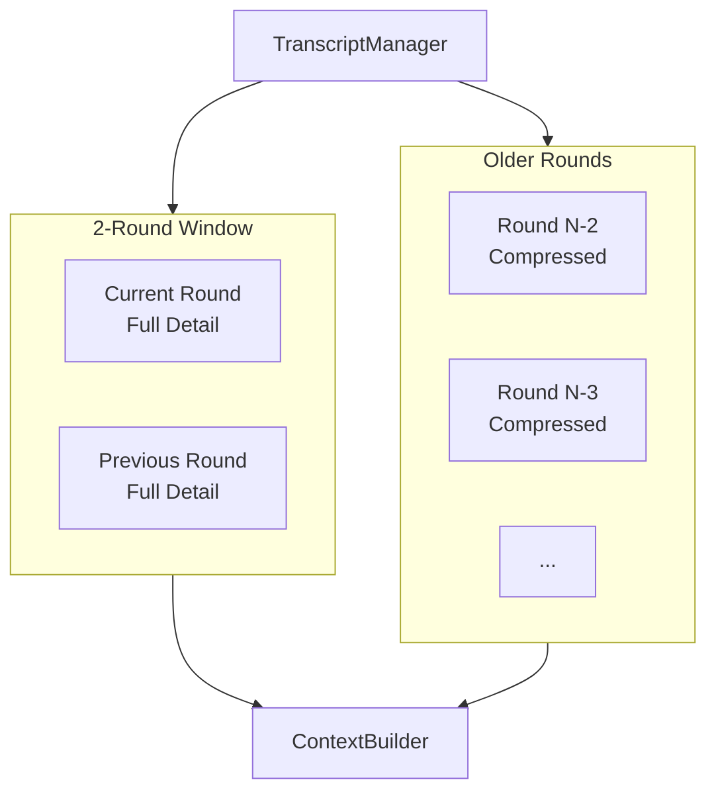

# System Overview

Core components, data flow, and storage model for the game engine.

## Core Components

## Game Loop (Phases)

- Night Zero: Mafia coordination only (no kill)
- Day: speeches -> nominations -> vote -> optional revote -> last words
- Night: Mafia kill coordination -> Detective investigation -> kill applied
- Win check after each phase

## Player Turn Data Flow

## Transcript Window

## Context Visibility

- Players only receive public events (private fields filtered).
- Full events (including private fields) are written to JSON logs for review.
